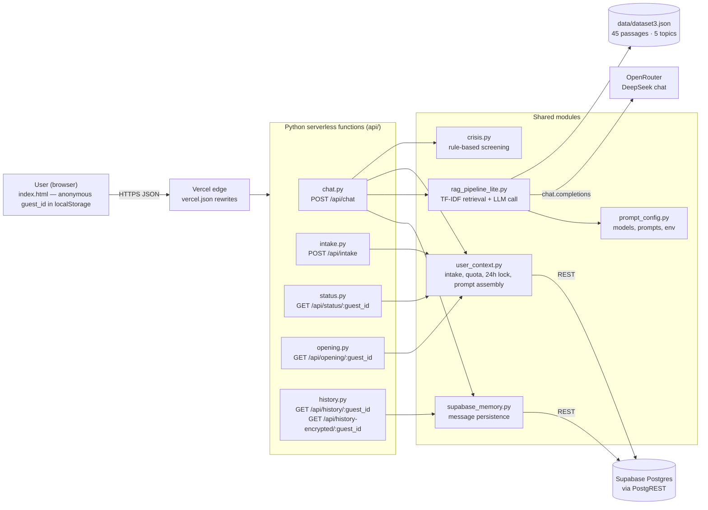
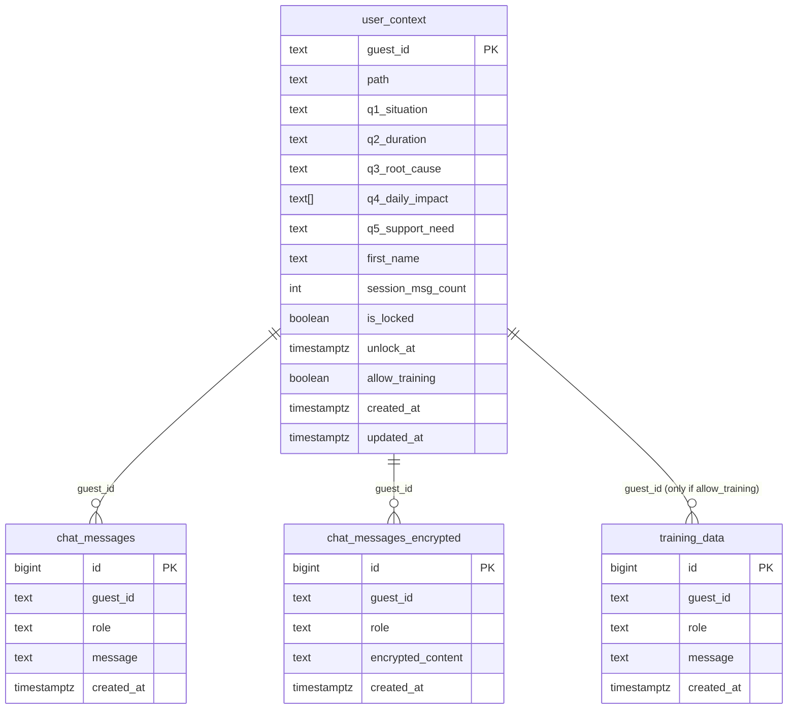

# Saferena — System Architecture

Saferena is an anonymous, no-login emotional-support chat app. A static single-page
frontend talks to a handful of Python serverless functions on Vercel. Those functions
screen every message for crisis language in code, enforce a per-session message limit,
retrieve grounding passages from a curated dataset, and only then call a language model.

Companion documents: [API reference](API.md) · [Crisis evaluation](crisis_evaluation.md) ·
[Retrieval benchmark](retrieval_benchmark.md) · [Setup](../MAIN_IPYNB_SETUP.md)

## 1. System context



**Why serverless + pure Python.** Vercel functions have a tight memory budget, so the
production retriever is a dependency-free TF-IDF index (`rag_pipeline_lite.py`). The heavier
FAISS + sentence-transformers pipeline (`rag_pipeline.py`) is kept for local experiments and
is what `server.py` (Flask dev server) uses.

## 2. Request lifecycle: `POST /api/chat`

The order below is deliberate. Crisis screening runs **before** the rate limit so a user who
has exhausted their session still receives helplines, and the model is never consulted for a
high-risk message.

```mermaid
sequenceDiagram
    autonumber
    participant B as Browser
    participant C as chat.py
    participant CR as crisis.py
    participant UC as user_context.py
    participant M as supabase_memory.py
    participant RP as rag_pipeline_lite.py
    participant LLM as OpenRouter

    B->>C: POST /api/chat {messages, guestId, sessionId, ...}
    C->>C: validate body, extract last user message
    alt message equals OVERRIDE_CODE
        C->>UC: lift session limit
        C-->>B: {reply: "Access restrictions lifted…"}
    end
    C->>M: save user message, load last 10 turns
    C->>CR: assess(last_user_msg)
    alt level == "high"
        C->>UC: get_context (first name only)
        C->>M: save crisis reply
        C-->>B: {reply: helplines + invitation, crisis: true}
    end
    C->>UC: check_and_apply_auto_unlock(guest_id)
    alt locked or session_msg_count >= 15 (and no personal key)
        C-->>B: {reply: "This session has reached its natural close…"}
    end
    C->>RP: generate_assistant_reply(messages, memory, checkin, crisis_level)
    RP->>RP: retrieve(query) → top-5 passages by TF-IDF cosine
    RP->>RP: build_context + build_system_prompt_v2 (+ crisis annotation if "elevated")
    RP->>LLM: chat.completions (≈110 max tokens, temp 0.7)
    LLM-->>RP: reply
    RP->>RP: sanitize_reply (strip meta-notes); append helplines on provider error if risk ≠ none
    RP-->>C: {reply, summary}
    C->>M: save assistant reply (+ encrypted blob, + training copy if opted in)
    C->>UC: increment_msg_count (only after a successful reply)
    C-->>B: {reply, summary}
```

## 3. Safety layers

| Layer | Where | Behaviour |
|---|---|---|
| Deterministic crisis screen | `api/crisis.py` | Regex tiers: **high** (explicit / passive ideation, self-harm, planning, Hinglish) → helplines returned, model bypassed. **elevated** (hopelessness, worthlessness, withdrawal) → a safety annotation is added to the system prompt. Negation rules downgrade third-party, past-tense, media and academic mentions. Measured in [crisis_evaluation.md](crisis_evaluation.md). |
| Failure-path helplines | `rag_pipeline_lite.py` | If the model call fails and the message carried any risk, the human-readable error copy is followed by the helpline block. |
| Session limit | `user_context.py` | 15 messages per session, then `is_locked = true` with `unlock_at = now + 24h`. `check_and_apply_auto_unlock` clears the lock lazily on the next request. Users with a personal API key are exempt. |
| Reply hygiene | `sanitize_reply` | Strips `(Note: …)`, `[Note: …]` and trailing meta-lines the model sometimes emits. |
| Output escaping | `index.html`, `chatindex.html`, `onboarding-overlay.html` | All user- and model-authored text passes through `escapeHTML` before insertion into the DOM. |
| Error responses | every handler | 500s return `{"error": "Internal server error"}`; tracebacks go to server logs only. |

## 4. Personalisation and prompt assembly

`build_system_prompt_v2(guest_id)` in `user_context.py` composes the system prompt from:

1. `BASE_SYSTEM_PROMPT` (short replies, one question at a time, never claim to be a therapist).
2. The intake answers stored in `user_context` (`path`, `q1_situation` … `q5_support_need`, `first_name`).
3. A session-progress hint keyed on `session_msg_count` so the model can close the session warmly on the final message.
4. Retrieved dataset passages (one empathy "stream" line, one analysis mode, one reflective question) from `build_context`.
5. The crisis annotation when the level is `elevated`.

Custom prompts for specific `(path, support_need)` combinations live in `CUSTOM_SYSTEM_PROMPTS`.

## 5. Data model (Supabase)



- `guest_id` is a random client-generated identifier. No email, phone, or login exists anywhere in the system.
- `chat_messages_encrypted` holds AES-GCM blobs produced in the browser; the key never leaves the device.
- `training_data` is written only when the user opted in during onboarding.
- All tables have row-level security enabled; the API uses the service-role key from the server side only.

## 6. Retrieval

`data/dataset3.json` holds 5 topics. Each topic has `user_signals` (typical phrasings),
`drk_stream` (empathic reflections), `drk_analysis_modes` (`neuro`, `psych`, `philosophy`)
and `deep_questions`. At import time `rag_pipeline_lite.py` flattens these into 45 passages
with metadata, builds a TF-IDF vocabulary, and pre-computes vectors.

`retrieve(query, k=5)` scores each passage by cosine similarity and additionally boosts every
passage of a topic whose `user_signals + tags + emotions` string matches the query. This keeps
recall up when the user's wording matches a signal but not a passage.

The trade-off between this lexical approach and dense embeddings is measured in
[retrieval_benchmark.md](retrieval_benchmark.md).

## 7. Configuration

All secrets and tunables come from environment variables (see `.env.example`). There is
deliberately no fallback API key in source. Key variables:

| Variable | Purpose | Default |
|---|---|---|
| `OPENROUTER_API_KEY` | LLM access (required) | — |
| `CHAT_MODEL` / `SUMMARY_MODEL` | vendor-prefixed OpenRouter slugs | `deepseek/deepseek-chat` |
| `CHAT_MAX_TOKENS` | reply length cap | `110` |
| `MAX_MESSAGES_PER_SESSION` | messages before the reflection gate | `15` |
| `OVERRIDE_CODE` | optional phrase that lifts the limit | unset (disabled) |
| `SUPABASE_URL`, `SUPABASE_SERVICE_ROLE_KEY` | memory and quota; app degrades to stateless if absent | — |

## 8. Repository map

```
api/                 serverless handlers + shared modules
  chat.py            main conversation endpoint (flow in §2)
  crisis.py          deterministic crisis screening
  user_context.py    intake storage, quota, 24h lock, prompt assembly
  rag_pipeline_lite.py  production retrieval + LLM call
  rag_pipeline.py    FAISS/sentence-transformers variant (local only)
  supabase_memory.py message persistence (plain, encrypted, training)
  prompt_config.py   env-driven model config and prompt templates
  intake.py status.py opening.py history.py   thin HTTP adapters
data/dataset3.json   curated retrieval corpus
docs/                this file, API.md, evaluation reports
scripts/benchmark_retrieval.py   TF-IDF vs dense benchmark
tests/               crisis evaluation set + pytest suite
index.html           primary UI (onboarding, chat, gate, encryption)
chatindex.html       alternate UI
server.py            Flask dev server mirroring the Vercel routes
supabase_schema.sql  database schema
vercel.json          routing
```
